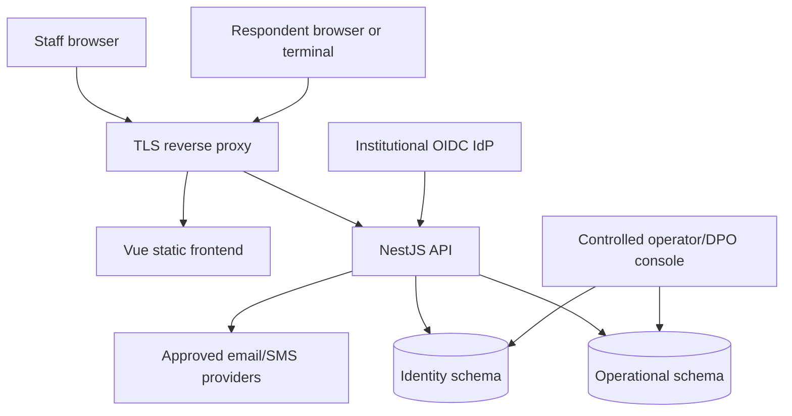

# System architecture

CHPM Survey is a browser application backed by a REST API and two logical PostgreSQL data domains. Its central design goal is to let operational staff run questionnaire campaigns without giving them access to direct respondent contact data.

## Runtime topology

In connected deployments, Nginx terminates TLS and routes frontend, API, and health traffic. Production staff authentication uses institutional OIDC with MFA. The Vue application contains no trusted authorization logic. The NestJS API validates staff sessions and respondent tokens, enforces roles/scopes, and performs all persistent mutations.

## Trust boundaries

| Boundary | Trusted responsibility | Never assume |
| --- | --- | --- |
| Browser to API | TLS, configured CORS origin, HTTP-only session cookie, request validation | Hidden UI controls enforce authorization |
| Staff session | Opaque token, server-side expiry/revocation, user role and scope loaded from the database | A role grants access outside its organization/site/building |
| Respondent link | HMAC signature, stored token hash, invitation/session state, expiry | A public code alone authorizes access |
| Operational to identity schema | Explicit service access and encrypted contact values | Pseudonymization makes all operational data anonymous |
| API to provider | Approved configuration, minimal recipient/payload, transport security | Simulation providers are acceptable in production |
| DPO export | Independent DPO/legal validation, named DPO, explicit codes, encrypted output, expiry, dual audit | A business or technical administrator may browse/search direct contact data |

## Data domains

### Operational domain

The operational schema stores internal users and sessions, organizations, sites, buildings, questionnaires, immutable versions, invitations, response sessions, answers, submissions, telemetry, terminals, notifications, legal-workflow records, secure-document metadata, and application audit logs.

Although respondent records are pseudonymized, public codes, free text, timestamps, building assignments, and rare combinations may still be personal data. Treat the whole operational database as sensitive.

### Identity domain

The identity schema stores direct contact values as AES-256-GCM ciphertext, HMAC hashes used for controlled comparison, encrypted durable outbound-delivery jobs, provider-delivery events, and identity-vault audit evidence.

Application roles do not receive decrypted values through normal business API responses. Only a DPO may execute a double-validated judicial request; the output is an encrypted envelope or an encrypted local-console file, never a general contact search.

### Client-side demo domain

`VITE_DEMO_MODE=true` uses browser-local fixtures and a simulated API. It is not a privacy or persistence boundary and must never receive real respondent, patient, employee, or research-participant data.

## Principal flows

### Staff authentication

1. The login page reads `/api/auth/config` and starts OIDC Authorization Code with PKCE.
2. The API validates state, nonce, PKCE, RSA signature, issuer/audience, timestamps, verified email, and the configured MFA claim.
3. The verified email must match a pre-provisioned active account with a local role and scope.
4. The API stores a hash of a random session token and sets the HTTP-only secure session cookie.
5. Each protected request reloads session, user, role, and scope; logout and sensitive account changes revoke sessions server-side.

### Invitation and response

1. A moderator or site manager selects a published questionnaire version and an authorized building.
2. The API creates an invitation, public code, and signed respondent token.
3. Direct contact data and the durable provider job payload are encrypted in the identity domain; operational views receive masked contact only.
4. Queue workers claim/retry jobs across restarts and call the configured provider with bounded timeouts.
5. The respondent resolves the token during the published collection window, autosaves answers, optionally emits limited telemetry, and submits.
6. Final submission locks the response session and answers. Resubmission is rejected.

### On-site terminal

1. An authorized staff member registers a terminal and receives its launch token once.
2. A moderator assigns eligible invitations to the terminal.
3. The terminal token lists only in-scope pending invitations.
4. Opening an invitation issues a respondent token; subsequent respondent requests require both respondent and terminal tokens.
5. Revoking or regenerating the terminal token invalidates prior access.

### Paper workflow

1. Staff create a `paper_form` invitation without email or phone.
2. The browser generates a blank PDF locally.
3. A moderator transcribes completed answers through the paper-entry action.
4. The backend validates the published questionnaire, creates a locked submission, records warnings, and audits the entry.

A `refusal_record` is field-tracking data only. It never creates a response session or submission.

### Statistics and export

Aggregate statistics apply a configured minimum-cell threshold to totals and every version/site/building/language/delivery/question segment. Insufficient cells return suppression indicators rather than counts or rates. Analyst-only submission detail and pseudonymized exports exclude the identity schema and direct contact data, but remain controlled personal data.

### Exceptional identity access

The judicial workflow is organization-scoped and requires independent legal and DPO validation. A DPO may execute only the approved list of up to 50 public codes. The API returns an AES-256-GCM envelope; the local console is an alternative controlled file path bound to the same validated request. Both paths fingerprint, expire, and audit the output.

## Authorization model

Controller decorators implement coarse RBAC. Services implement contextual checks for organization, site, building, questionnaire ownership, invitation assignment, and workflow state. Security-sensitive reads often return `404` rather than confirming that an out-of-scope object exists.

The current role-to-permission mapping is described in [Permissions and scope](recette/permissions-matrix.md). The backend source remains authoritative.

## Security controls implemented in code

- OIDC Authorization Code/PKCE with RSA-token and MFA-claim validation; database-backed local lockout for approved non-production use.
- Opaque staff sessions stored by hash.
- HMAC-signed respondent and terminal tokens stored by hash.
- AES-256-GCM contact encryption with authenticated metadata.
- HMAC contact hashes with a separate pepper.
- DTO whitelist validation and rejection of unknown fields.
- RBAC and ABAC enforcement.
- Configured-origin CORS with credentials.
- Correlation identifiers and structured request logs.
- Browser-oriented security headers.
- Durable encrypted email/SMS queues with retry, stale-lock recovery, and provider timeouts.
- Scheduled retention across responses, identity mappings, delivery records, audits, and export expiry.
- Organization-scoped application and identity-vault audit evidence.
- Production-like environment validation for secrets, TLS origins, and provider modes.

## Deployment responsibilities and limitations

The application does not by itself provide network segmentation, host hardening, centralized secrets, shared multi-instance rate limiting, database high availability, log retention, SIEM alerting, key custody, provider contracts, disaster-recovery evidence, or legal approval. These are deployment controls.

The single-node Compose reference and process-local generic request limiter are deployment constraints. See the root README and production installation guide for scale-out requirements.
