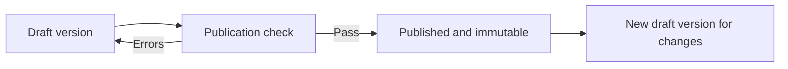

# Questionnaire author manual

This manual is for project administrators and questionnaire administrators who create and publish questionnaire versions.

## Understand the lifecycle

Only drafts are editable. Publication is an irreversible lifecycle transition for that version.

## Create a questionnaire

1. Open **Questionnaire builder**.
2. Create the questionnaire with a stable code and clear title.
3. Add a plain-language description and purpose.
4. Choose the default language.
5. Save the draft and confirm it appears in the list.

Use a code that will remain meaningful over time. Do not put a respondent name, site name that may change, or version number in the stable questionnaire code.

## Organize groups

Groups define sections and pagination.

1. Add a group with a short title and optional instructions.
2. Set display order and the number of questions per page.
3. Enable randomization only when the instrument and analysis plan permit it.
4. Add a condition only after testing both matching and non-matching paths.

One question per page is often easier on mobile and for sensitive content, but it increases navigation. Follow the validated instrument and accessibility evidence.

## Add questions

Supported types include short/long free text, single choice, multiple choice, Likert, number, date, and information-only content.

For every question:

1. Set a stable question code.
2. Write the respondent-facing label in plain language.
3. Mark it required only when omission would invalidate the approved purpose.
4. Add help text when instructions cannot fit in the label.
5. Configure answer options or a Likert scale as required.
6. Add a contextual pop-up only for a term that genuinely needs explanation.
7. Preview keyboard, mobile, and screen-reader behavior.

Do not request direct identifiers in free text. Explain what respondents should avoid entering.

## Conditional rules

A rule has a trigger, an effect, a priority, and an active state. Rules can alter the visible path, so a syntactically valid rule can still create a harmful or incomplete questionnaire.

Test at least:

- the trigger matches;
- the trigger does not match;
- the source answer changes after navigation;
- a resumed session follows the same path;
- required hidden questions do not block submission;
- multiple active rules resolve in the intended priority order.

Record the test cases in the version's approval evidence.

## Version and language management

Create a new version when wording, structure, scoring inputs, conditions, dates, or language content changes. Choose an unambiguous version label and opening/closing dates if applicable.

The demo UI can simulate creating a language draft. The connected backend does not currently expose the translation endpoint, so confirm the deployment's supported workflow before planning production translation work. Never assume that changing the interface language translates questionnaire content.

## Preview and publication

Before publication:

1. Open the preview and complete every path as a respondent.
2. Check labels, answer options, required status, dates, pop-ups, conditions, and page order.
3. Run the publication check.
4. Resolve every reported error.
5. Obtain the required content, privacy, and accessibility approvals.
6. Publish the version.
7. Confirm that it is marked published and cannot be edited.

If an error is discovered after publication, stop new invitations where appropriate and create a corrected version. Preserve the original for audit and analysis; do not rewrite history.

## Safe content checklist

- Purpose and notice match the approved processing.
- No question asks for unnecessary identifying data.
- Free-text guidance discourages identifiers.
- Clinical/research instrument wording and attribution are approved.
- Every option is distinct and understandable.
- Likert anchors and numeric range agree.
- Conditional paths are complete.
- Keyboard focus, labels, errors, and contrast were tested.
- The exact published version is recorded in the study/service documentation.
